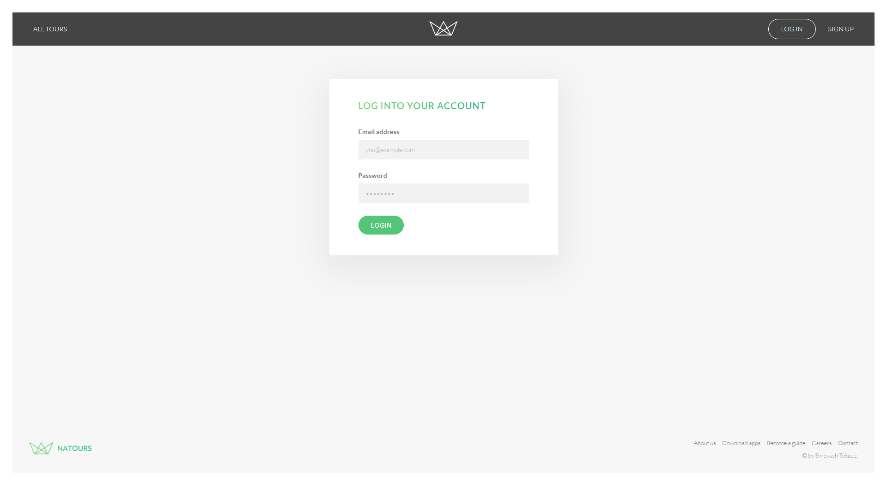
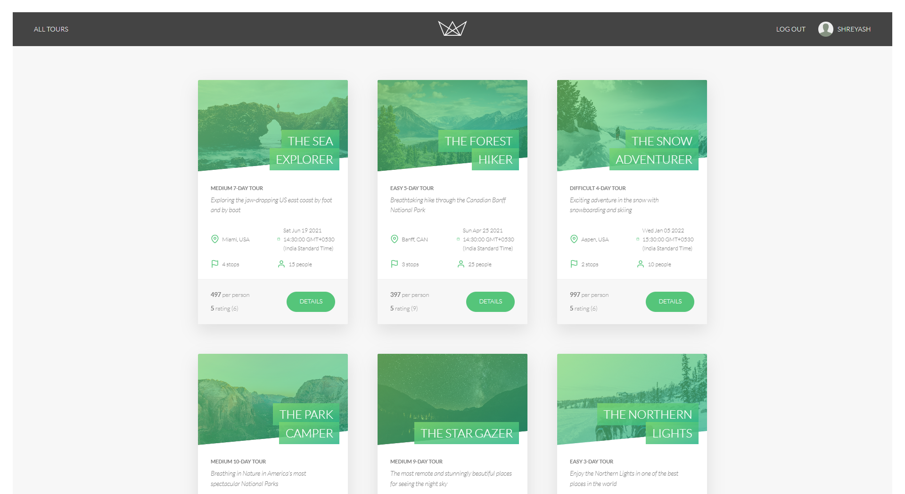
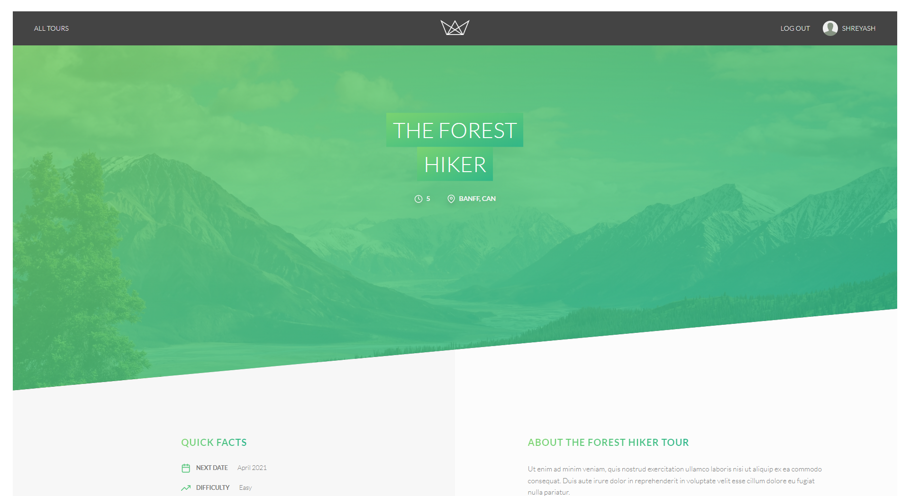
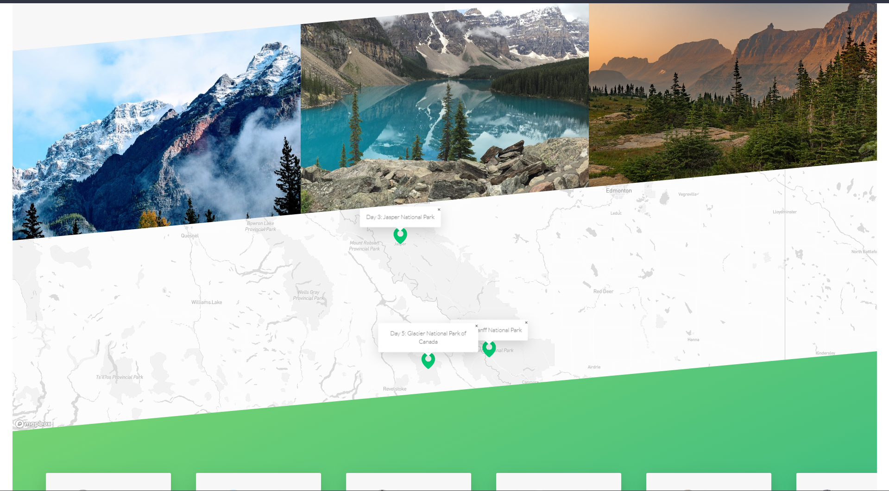
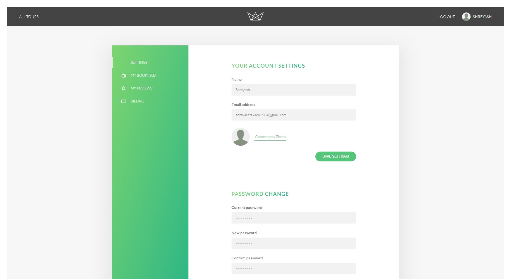

## Natours :- A Tour Booking Website

This is a website for booking tours. It is built using modern technologies: node.js, express, mongoDB, mongoose.

### Features

- Authentication, Authorization and Security
- Payment using Stripe
- Emailing using SendGrid
- Book tours and manage bookings
- Manage user account, password, profile and bookings
- View tours and their locations on map

### Technologies Used

- Node.js
- Express
- MongoDB
- Mongoose
- Pug
- Stripe
- SendGrid
- Mapbox

### Mongoose

- This project makes extensive use of the mongoose library.
- Everything from simple CRUD operations to complex aggregation pipelines is done using mongoose.
- Even use geolocation queries has been made to map the data on the map.
- API features like pagination, filtering, sorting, aliasing, etc. are also implemented using mongoose.

### How to run

- Clone the repository
- Run `npm install`
- Create a config.env file in the root directory and add the following variables:
  - NODE_ENV=development
  - PORT=3000
  - DATABASE=your_mongodb_url
  - DATABASE_PASSWORD=your_mongodb_password
  - JWT_SECRET=your_secret
  - JWT_EXPIRES_IN=90d
  - JWT_COOKIE_EXPIRES_IN=90
  - EMAIL_USERNAME=your_email_username
  - EMAIL_PASSWORD=your_email_password
  - EMAIL_HOST=your_email_host
  - EMAIL_PORT=your_email_port
  - EMAIL_FROM=your_email_from
  - SENDGRID_USERNAME=your_sendgrid_username
  - SENDGRID_PASSWORD=your_sendgrid_password
  - SENDGRID_FROM=your_sendgrid_from
  - STRIPE_SECRET_KEY=your_stripe_secret_key
  - STRIPE_WEBHOOK_SECRET=your_stripe_webhook_secret
  - MAPBOX_TOKEN=your_mapbox_token
- Run `npm run dev` to start the server in development mode
- Run `npm run start` to start the server in production mode
- Run `npm run build:js` to start the package bundler
- Open `http://localhost:3000` in your browser to view the website

## Screenshots

### Authentication

### Home Page

### Tour Details

### User Account

## This is created using a Udemy course by Jonas Schmedtmann
